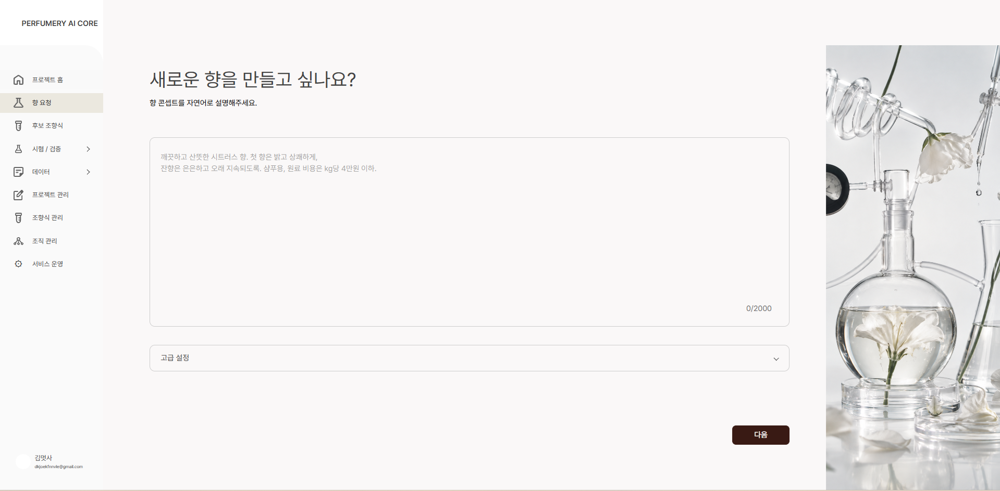

  

# Perfumery AI Studio

> 향의 언어를 데이터로, 데이터를 조향식으로.  
> **자연어 향 의도를 정량 조향식과 검증 가능한 연구로 연결하는 AI 조향 플랫폼**

Perfumery AI Studio는 원하는 향을 자연어로 표현하고,
이를 바탕으로 조향 후보를 설계·비교·검토하는 AI 기반 조향 R&D 플랫폼입니다.

원료의 안전성·가격·가용성을 함께 고려하고,
조향식의 변경 이력과 평가 근거, 실험 결과를 연결하여
연구자와 개발팀의 협업을 지원합니다.

 

## 🔗 Links

- [GitHub Organization](https://github.com/WantedAI12)
- [Figma](https://www.figma.com/design/mmN9ALcMmZ2TmnHQQewMsa?node-id=0-1)

 

## 👥 Team Members

### PM

| Nickname / Name | Role |
|---|---|
|  | PM | 김준성

 

### Design

| Nickname / Name | Role |
|---|---|
|  | Design | 최민서

 

### Frontend

| Nickname / Name | Role |
|---|---|
|  | Frontend | 양채현

 

### Backend

| Nickname / Name | Role |
|---|---|
|  | Backend | 인석진
|  | Backend | 신준호

 

### AI

| Nickname / Name | Role |
|---|---|
|  | AI | 김준성

 

## 📁 Repositories

| Repository | Description |
|---|---|
| `WantedAI_FE` | Perfumery AI Studio 웹 프론트엔드 |
| `WantedAI_BE` | 프로젝트·조향식·검토 이력을 관리하는 백엔드 |
| `WantedAI_Ai` | 자연어 향 의도 해석·조향 후보 생성·평가 AI |
